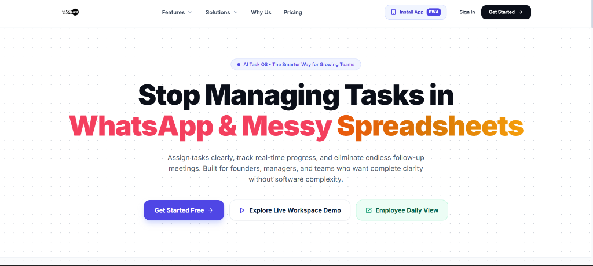
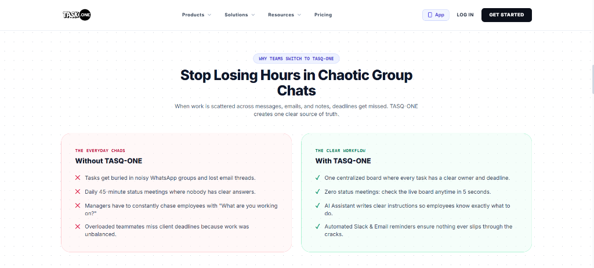
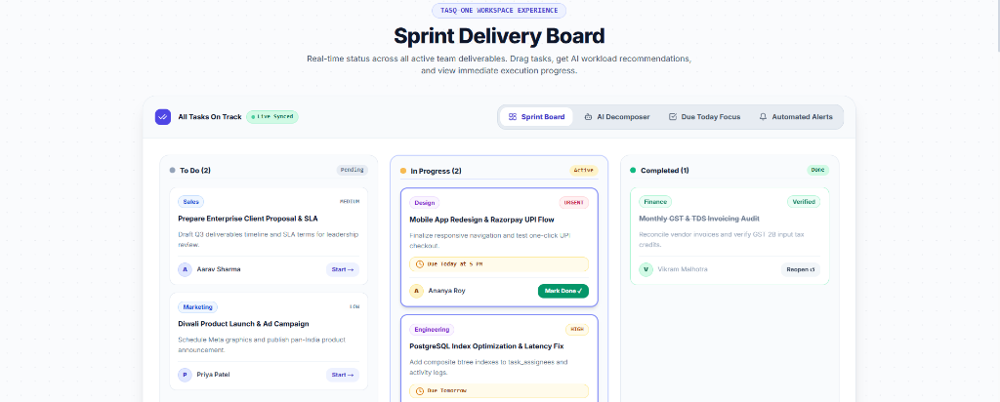
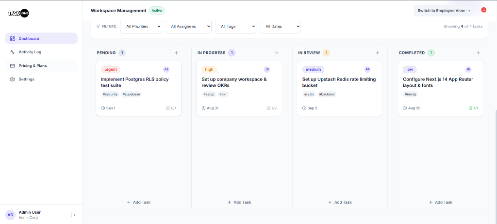
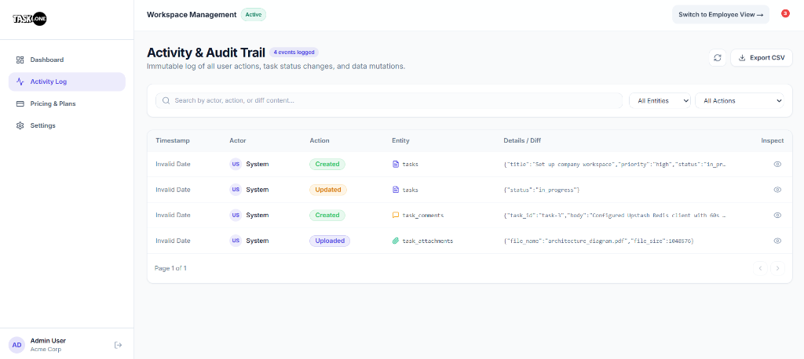

<div align="center">

# ⚡ TASQ-ONE
### Version 2.5 — The Intelligent Task Operating System for High-Velocity Teams

**Stop Managing Tasks in WhatsApp Group Chats & Messy Spreadsheets.**  
*Assign deliverables with single-sentence clarity, track verified progress in real time, and eliminate endless follow-up meetings.*

[](https://github.com/Tusharsinghoffical/Saas-T1)
[](https://nextjs.org/)
[](https://www.typescriptlang.org/)
[](https://tailwindcss.com/)
[](https://supabase.com/)
[](https://groq.com/)
[](https://cloudflare.com/)
[](#)
[](#-license)

<br/>



<br/>

[Overview](#-overview) • [What's New in v2.5](#-whats-new-in-v25) • [The Problem & Solution](#-the-problem--the-solution) • [Visual Product Tour](#-visual-product-tour) • [Core Capabilities](#-core-capabilities) • [Role-Based Portals](#-role-based-portals) • [Performance](#-performance-architecture) • [Enterprise Security](#-enterprise-security--multi-tenant-architecture) • [Indian Localization](#-indian-localization--compliance) • [Tech Stack](#-technology-stack-deep-dive) • [Quick Start](#-quick-start) • [Contact](#-support--contact)

<br/>

> 🌐 **Live Production Instance:** [https://tasq-one.onrender.com](https://tasq-one.onrender.com)  
> 💼 **Tailored Solutions:** [/solutions](https://tasq-one.onrender.com/solutions) • 💳 **Pricing:** [/pricing](https://tasq-one.onrender.com/pricing) • ⚡ **Features:** [/features](https://tasq-one.onrender.com/features)

</div>

---

## 📖 Overview

**TASQ-ONE v2.5** is an enterprise-grade, multi-tenant Task Operating System architected specifically for growing startups, digital agencies, and engineering organizations who demand **complete operational clarity without software bloat**.

Traditional project management tools suffer from steep learning curves, cluttered feature sets, and lack of real-time accountability—forcing teams back into unstructured WhatsApp group chats and stale spreadsheets. TASQ-ONE bridges this gap with **single-click AI deliverable decomposition**, **distraction-free employee morning checklists**, **strict dependency DAG enforcement**, **immutable cryptographic audit trails**, and **automated multi-channel async broadcasts**, empowering founders and managers to reclaim **10+ hours every week**.

---

## 🆕 What's New in v2.5

### 🚀 Performance Overhaul (10-15s → 1-3s Load Times)
The most impactful update in this release — complete elimination of sequential database waterfall queries that caused 10-15 second page load delays:

| Area | Before | After |
|:---|:---:|:---:|
| `listOrgMembers` | 3 sequential DB calls (~12s) | `Promise.all` parallel (~3s) |
| Employee Dashboard Tasks | Sequential 2-query chain | Fully parallel fetch |
| Manager Dashboard Teams | Sequential 2-query chain | `Promise.all` parallel |
| Auth Context (`requireAuth`) | Supabase hit on every request | 15s in-memory L1 cache |
| Org Member Lookup | No cache | 20s Redis + L1 cache |
| Redis Client | No timeout (could hang indefinitely) | 600ms hard timeout + L1 memory |

### 🔄 10-Second Auto-Refresh Across All Role Dashboards
Every dashboard now has a **live auto-refresh system** with full user control:
- **Animated countdown badge** showing seconds until next auto-sync
- **Toggle ON/OFF** with a single click
- **Manual sync button** with spinning indicator
- Integrated into: Admin Dashboard, Admin Team, Admin Activity & Audit Trail, Manager Dashboard, Manager Team, Employee Dashboard

### 🎨 Complete Employee Dashboard UI Redesign
The employee portal received a comprehensive visual overhaul:
- **Modern Profile Identity Bar** — Avatar initials, one-click Employee ID copy, team badge, greeting by time of day (Good Morning/Afternoon/Evening)
- **Clickable Metric Cards** — Due Today, In Progress, Upcoming (7D), Completed — each card acts as a filter tab
- **Unified Filter Bar** — Tab pills + search input + priority dropdown in one clean toolbar
- **Premium Task Cards** — Priority badges, overdue alerts, subtask counters, inline status dropdowns, 1-click quick-complete circle

### 📊 Activity & Audit Trail Redesign
- **Zero raw JSON `{}`** — all audit log entries now render as human-readable formatted pills, badges, and cards
- **Structured Inspector Modal** — Diff viewer shows a clean card grid of changed property→value pairs instead of raw JSON code blocks
- **Status chips**, **priority pills**, **comment quote bubbles**, and **team assignment tags**
- **Export to CSV** with current filter applied

### 👥 Assigned Team Inline Editing (Admin & Manager)
- Team assignment is now an inline editable dropdown directly in the team table — no modal needed
- Changes persist immediately and update across the Kanban board and all dashboards
- Auto-creates team if it doesn't exist yet

### 🏗️ Workspace Sidebar Cleanup
- Removed redundant stacked `Workspace / Organization / Plan / Pro` card from the admin sidebar
- Cleaner, more focused navigation structure

### 🐛 BugLens Audit Fixes (TypeScript)
- Resolved `OrgMember` property mismatch (`fullName` vs `full_name`)
- Fixed missing optional fields in `KanbanTaskItem`
- Fixed `KanbanTaskItem` not imported in Admin Dashboard

---

## ⚖️ The Problem & The Solution

When work is scattered across fragmented messages, emails, and notes, deadlines get missed and leaders waste hours chasing status updates. TASQ-ONE creates **one unified, verified source of truth**.

<div align="center">
  
</div>

<br/>

| Everyday Chaos (Without TASQ-ONE) | Streamlined Velocity (With TASQ-ONE) |
| :--- | :--- |
| ❌ Tasks get buried in noisy WhatsApp groups and lost email threads. | ✅ **Centralized Board:** Every task has a verified owner, priority, and strict deadline. |
| ❌ Daily 45-minute status meetings where nobody has clear answers. | ✅ **Zero Status Meetings:** Check verified deliverable progress in 5 seconds without disturbing teammates. |
| ❌ Managers constantly chase employees asking *"What are you working on?"*. | ✅ **AI Task Decomposition:** Converts vague requests into bulletproof specifications with acceptance criteria. |
| ❌ Overloaded teammates miss client deadlines due to unbalanced workload. | ✅ **Automated Async Alerts:** Automated Slack & Email updates ensure nothing ever slips through the cracks. |
| ❌ No audit trail — nobody knows who changed what or when. | ✅ **Immutable Audit Log:** Cryptographically verifiable, real-time stream of every workspace mutation. |

---

## 📸 Visual Product Tour

### 1. 🗂️ Live Sprint Delivery Board
Interactive Kanban workspace with drag-and-drop column transitions, real-time priority badges, assignee avatars, and instantaneous filtering across squads.

<div align="center">
  
</div>

<br/>

### 2. ⚡ Workspace Management Dashboard
Admin executive view providing macro-level tracking across departments, task status distributions, and team velocity metrics with **live 10-second auto-refresh**.

<div align="center">
  
</div>

<br/>

### 3. 🔍 Immutable Activity & Audit Trail
Real-time tamper-proof audit trail capturing every task mutation, status shift, assignee change, and file upload. Fully redesigned in v2.5 — zero raw JSON, human-readable formatted entries with export to CSV.

<div align="center">
  
</div>

<br/>

### 4. 👤 Employee Personal Focus Dashboard (v2.5 Redesigned)
A completely redesigned personal workspace portal for every team member — clean profile identity card, interactive metric tiles, and a prioritized task list.

---

## 🚀 Core Capabilities

### 1. 🤖 Instant AI Task Decomposer (Groq Llama 3.3 70B)
Transforms ambiguous 1-line inputs into production-ready task specifications in milliseconds:
- **Acceptance Criteria Generation:** Generates 4-point verifiable checklist items for each deliverable.
- **Effort & Time Estimation:** Predicts realistic completion hours and milestone timelines.
- **Smart Assignee Recommendation:** Analyzes team department workloads and suggests the ideal assignee.
- **Department Routing:** Automatically tags deliverables (`Engineering`, `Sales & Legal`, `Design`, `Operations`).

### 2. 🎯 "Due Today" Employee Morning Focus View (v2.5 Enhanced)
Designed to eliminate cognitive overload for team members:
- **Redesigned Profile Hero Card:** Time-of-day greeting, Employee ID, team name, auto-refresh toggle.
- **Interactive Metric Cards:** Due Today, In Progress, Upcoming (7D), Completed — each is a clickable filter.
- **Premium Task Cards:** Priority badges, overdue alerts, subtask counters, 1-click quick-complete, inline status dropdown.
- **Search & Priority Filter Bar:** Real-time search across title, description, and tags.

### 3. 📢 Automated Multi-Channel Async Broadcasts
Keeps leadership and cross-functional teams in sync without synchronous interruptions:
- **Slack Release Cards:** Instant webhook broadcasts dispatching rich cards when deliverables reach `Completed`.
- **Weekly Executive Velocity Digest:** Automated Monday digests summarizing on-time completion rates, closed deliverables, and active blockers.

### 4. 🔗 Task Dependency DAG (Directed Acyclic Graph)
- Visually establishes dependency chains between interdependent deliverables.
- Enforces strict execution order: downstream tasks cannot transition to `In Progress` until prerequisite tasks are verified `Completed`.
- UI shows a blocker warning tooltip with the blocking task name.

### 5. 📋 Task Detail Slide-Over Panel
- Rich inline task view with comments, file attachments, assignees, subtasks, tags, priority, status, and due date.
- Real-time comment feed with `@mention` support and live broadcasting.
- Subtask progress bar with per-subtask completion toggle.

### 6. 🔔 Real-Time Notification System
- Bell icon with unread badge count in every dashboard header.
- Supabase Realtime channel pushes new notifications instantly (no polling delay).
- Types: `task.assigned`, `task.mentioned`, `task.due_soon`, `task.overdue`.

### 7. 📊 Immutable Activity & Audit Trail (v2.5 Redesigned)
- Cryptographically verifiable, tamper-proof log of every workspace action.
- Human-readable formatted entries — status chips, priority pills, comment quotes, and team tags.
- Structured inspector modal with diff card grid (no raw JSON).
- Export to CSV with active filters applied.
- **Auto-backfill** synthesis from existing tasks and profiles if log table is empty.

### 8. 👥 Team & Squad Management
- **Admin Portal:** Full CRUD for all members — create, invite, assign teams, update roles, soft-delete.
- **Manager Portal:** Scoped to own team employees only — add employees, view assignments.
- **Inline Team Editing:** Dropdown team assignment directly in the table row — no modal needed.
- **Auto-team creation:** New team names are auto-created if they don't exist.

### 9. 🔄 10-Second Auto-Refresh with Toggle (v2.5 New)
- Available across **6 pages**: Admin Dashboard, Admin Team, Admin Activity, Manager Dashboard, Manager Team, Employee Dashboard.
- Animated countdown badge with live seconds display.
- Manual sync button with refresh animation.
- Toggle ON/OFF with a single click — preference is session-persistent.

### 10. 💰 ROI Capacity Calculator
- Interactive savings engine calibrated to the Indian tech ecosystem (**₹1,200/hr** average knowledge worker value).
- Quantifies exact monthly hours saved and direct rupee bottom-line savings based on team size.

---

## 🧑‍💼 Role-Based Portals

TASQ-ONE implements a **3-tier RBAC (Role-Based Access Control)** system with completely isolated portals:

| Feature | 👑 Admin | ⚡ Manager | 👤 Employee |
|:---|:---:|:---:|:---:|
| Create & assign tasks to anyone | ✅ | ✅ (own team) | ❌ |
| View all org tasks | ✅ | ✅ (own team) | ❌ (own only) |
| Add / remove team members | ✅ | ✅ (employees only) | ❌ |
| View Activity & Audit Trail | ✅ | ❌ | ❌ |
| Assign team to members | ✅ | ❌ | ❌ |
| Update task status | ✅ | ✅ | ✅ (own tasks) |
| View personal focus dashboard | ✅ | ✅ | ✅ |
| Export Audit CSV | ✅ | ❌ | ❌ |
| Manage org settings | ✅ | ❌ | ❌ |

---

## ⚡ Performance Architecture

v2.5 introduces a **multi-layer caching and parallelization** strategy:

```
[Browser Request]
        │
        ▼
[Next.js API Route]
        │
        ▼
[requireAuth()] ──► L1 authContextCache (15s TTL, ~0ms)
        │
        ▼
[listOrgMembers()] ──► L1 + Redis members cache (20s TTL, ~0ms)
        │                    │
        │            Cache Miss?
        │                    │
        ▼                    ▼
[Promise.all()] ──── [ profiles query ]
                  ├── [ auth.admin.listUsers ]   ← All 3 in parallel
                  └── [ team_members query  ]
        │
        ▼
[dashboardRepository] ──► [tasks + assignments in parallel]
        │
        ▼
[Response: ~1-3s] ✅
```

### Caching Layers:
| Layer | TTL | Scope |
|:---|:---:|:---|
| `authContextCache` (in-memory) | 15s | Per user session |
| `listOrgMembers` (Redis + L1) | 20s | Per organization |
| `redisClient` L1 memory | 30s | Per cache key |
| Redis Upstash | Custom | Dashboard charts (60s) |
| Redis timeout guard | 600ms hard limit | All remote Redis calls |

---

## 🔒 Enterprise Security & Multi-Tenant Architecture

TASQ-ONE is built with a **Security-First, Zero-Trust Architecture** adhering to modern enterprise governance standards:

```
[Client Request] ──► [Upstash Redis Rate Limiter] ──► [Next.js Middleware JWT Verification]
                                                                  │
                                                                  ▼
[PostgreSQL Database] ◄── [Strict Row-Level Security (RLS) Policy Enforcement (Tenant Org ID)]
```

### Key Security Safeguards:

1. **PostgreSQL Row-Level Security (RLS):**
   - Every database query automatically filters against `(auth.jwt() ->> 'org_id')::uuid`.
   - Complete multi-tenant cryptographic isolation: Tenant A cannot view, mutate, or query Tenant B records under any circumstance.

2. **Privilege Escalation Defense (`0008_fix_privilege_escalation.sql`):**
   - Non-admin employees are strictly blocked from self-modifying their `role` or `org_id` columns via split database policies.

3. **Distributed Rate Limiting:**
   - Public and authentication endpoints are protected against brute-force attacks and DDoS via Upstash Redis sliding-window token buckets.

4. **Secure Cloudflare R2 Presigned Uploads:**
   - Direct-to-storage presigned URLs with strict 10MB file size ceiling and verified MIME type allowlists (`image/*`, `application/pdf`, `text/*`).

5. **Session Integrity & Custom JWT Claims:**
   - Dedicated Supabase Auth Hook (`custom_access_token_hook`) dynamically injects tenant context upon every authentication token issuance.

6. **In-Memory Auth Context Cache:**
   - Resolved `(userId, orgId, role)` tuples cached in-process for 15 seconds, preventing repeated Supabase auth calls on parallel requests without compromising session security.

---

## 🇮🇳 Indian Localization & Compliance

TASQ-ONE is tailored specifically for Indian startups, MSMEs, and high-velocity engineering hubs:

- **Currency & Numerals:** 100% localized in Indian Rupees (`₹` INR) with Indian comma numbering formatting (`en-IN`).
- **Data Privacy:** Designed in compliance with India's **Digital Personal Data Protection (DPDP) Act 2023** and GDPR principles.
- **Zero AI Model Training:** Customer proprietary workspace deliverables and task notes are never utilized to train public LLM models.
- **Enterprise Headquarters:** Designed with engineering operations centered in Delhi / Pune & Mumbai.

---

## 🛠️ Technology Stack Deep-Dive

| Subsystem | Technology | Purpose & Architectural Rationale |
| :--- | :--- | :--- |
| **Frontend Framework** | **Next.js 14 (App Router)** | Server-side rendering (SSR), streaming components, standalone Docker optimization |
| **Language** | **TypeScript 5.0+** | Strict end-to-end type safety across API boundaries and database schemas |
| **Styling & Design** | **Tailwind CSS 3.4** | Custom glassmorphism design system, micro-interactions, responsive layouts |
| **Database Engine** | **Supabase (PostgreSQL 15)** | Relational data integrity, ACID compliance, Row-Level Security (RLS) policies |
| **Real-Time Engine** | **Supabase Realtime** | Live Kanban updates, notification delivery, audit trail streaming |
| **AI Engine** | **Groq Cloud (Llama 3.3 70B)** | Sub-second ultra-fast LLM inference for deliverable decomposition |
| **Distributed Cache** | **Upstash Redis + L1 Memory** | Multi-layer caching: serverless Redis + in-process memory for sub-millisecond reads |
| **Object Storage** | **Cloudflare R2** | Zero-egress fee S3-compatible storage for task attachments and media |
| **Event Dispatch** | **Slack Incoming Webhooks** | Automated asynchronous delivery notifications |
| **Email Infrastructure** | **Resend** | High-deliverability transactional emails and executive weekly digests |
| **Analytics** | **PostHog** | Product analytics, event capture, funnel analysis |
| **Quality Assurance** | **Vitest** | Automated unit test suite and multi-tenant RLS isolation test runner |
| **Containerization** | **Docker + Docker Compose** | Self-hosted deployment with zero-dependency setup |
| **Cloud Hosting** | **Render.com** | Auto-deploy on push, managed SSL, production scaling |

---

## 🚀 Quick Start

### Prerequisites
- Node.js 18+ (22 recommended)
- A [Supabase](https://supabase.com/) project
- A [Groq](https://console.groq.com/) API key

### 1. Clone & Install

```bash
git clone https://github.com/Tusharsinghoffical/Saas-T1.git
cd Saas-T1
npm install
```

### 2. Configure Environment

```bash
cp .env.local.example .env.local
```

Edit `.env.local` with your credentials:

```env
# Supabase
NEXT_PUBLIC_SUPABASE_URL=https://your-project-ref.supabase.co
NEXT_PUBLIC_SUPABASE_ANON_KEY=your-anon-key
SUPABASE_SERVICE_ROLE_KEY=your-service-role-key

# Groq AI
GROQ_API_KEY=gsk_your_groq_api_key

# Upstash Redis (optional — falls back to in-memory)
UPSTASH_REDIS_REST_URL=https://your-redis.upstash.io
UPSTASH_REDIS_REST_TOKEN=your_token

# Cloudflare R2 (optional — for file attachments)
R2_ACCOUNT_ID=your_account_id
R2_ACCESS_KEY_ID=your_access_key
R2_SECRET_ACCESS_KEY=your_secret_key
R2_BUCKET_NAME=tasq-attachments
R2_PUBLIC_URL=https://pub-xxx.r2.dev

# Resend (optional — for email)
RESEND_API_KEY=re_your_resend_key
RESEND_FROM_EMAIL=noreply@yourdomain.com
```

### 3. Run Database Migrations

Apply all migrations from `supabase/migrations/` in your Supabase SQL editor in order (`0001_` → `0008_`).

### 4. Start Development Server

```bash
npm run dev
```

Open [http://localhost:3000](http://localhost:3000)

### 5. Docker Self-Hosted (Optional)

```bash
docker-compose up --build
```

Or use the included batch scripts:
```bat
docker-start.bat   # Start
docker-stop.bat    # Stop
```

---

## 📁 Project Structure

```
TASQ-ONE/
├── app/                          # Next.js App Router pages
│   ├── (admin)/admin/            # Admin portal (dashboard, team, activity, settings)
│   ├── (manager)/manager/        # Manager portal (dashboard, team)
│   ├── (employee)/employee/      # Employee portal (personal dashboard)
│   └── api/v1/                   # REST API routes
│       ├── dashboard/            # admin, manager, me (employee)
│       ├── tasks/                # CRUD + comments + attachments
│       ├── org/members/          # Team management
│       ├── activity/             # Audit trail
│       └── ai/                   # Groq AI endpoints
├── components/                   # Reusable UI components
│   ├── kanban/                   # KanbanBoard, KanbanColumn, TaskCard
│   ├── tasks/                    # TaskFormModal, TaskDetail, TaskCard
│   ├── ui/                       # Badge, Button, Modal, AutoRefreshControl, ...
│   ├── dashboard/                # ProductivityChart, MetricCard
│   └── notifications/            # NotificationBell
├── domains/                      # Business logic (Clean Architecture)
│   ├── tasks/                    # Task entity, repository, use cases
│   ├── users/                    # User entity, repository, use cases
│   ├── activity/                 # Audit log repository
│   └── organization/             # Org repository
├── infrastructure/
│   ├── redis/                    # redisClient (L1 + Upstash with 600ms timeout)
│   └── supabase/                 # supabaseServer, supabaseClient, types
├── shared/
│   └── middleware/               # rbacGuard (requireAuth with 15s auth cache)
├── store/                        # Zustand global task store (useTaskStore)
├── lib/
│   ├── supabase/                 # useRealtimeTasks hook
│   └── analytics/                # PostHog captureEvent
├── supabase/
│   └── migrations/               # 0001_init → 0008_security_hardening
└── tests/                        # Vitest unit tests + RLS isolation tests
```

---

## 📬 Support & Contact

For enterprise inquiries, pilot onboarding, bug reports, or feature requests:

- **📧 Engineering Support Desk:** [tasqoneworkos@gmail.com](mailto:tasqoneworkos@gmail.com) *(Response within 2 business hours)*
- **👨‍💻 Lead Developer & Architect:** [Tushar Singh](https://codewithmrsingh.me/) (`codewithmrsingh.me`)
- **🐛 Issue Tracker:** [https://github.com/Tusharsinghoffical/Saas-T1/issues](https://github.com/Tusharsinghoffical/Saas-T1/issues)
- **🏢 Headquarters:** Delhi / Pune, India

---

## 📄 Changelog

### v2.5 (Current)
- ⚡ **Performance Overhaul:** 10-15s load → 1-3s via `Promise.all` parallelization + multi-layer caching
- 🔄 **Auto-Refresh System:** 10-second live sync with countdown badge and toggle button across all 6 dashboards
- 🎨 **Employee Dashboard Redesign:** New profile hero card, interactive metric tiles, premium task cards
- 📊 **Audit Trail Redesign:** Human-readable formatted entries, structured inspector modal, CSV export
- 👥 **Inline Team Assignment:** Edit team directly in table row for all roles
- 🏗️ **Admin Sidebar Cleanup:** Removed redundant workspace/plan card
- 🐛 **TypeScript Bug Fixes:** OrgMember type mismatch, KanbanTaskItem import fixes

### v2.0
- Initial multi-role dashboard system (Admin / Manager / Employee)
- Groq AI task decomposer integration
- Supabase Realtime Kanban board
- Immutable activity & audit trail
- Cloudflare R2 file attachments
- Multi-tenant RLS security hardening

---

## 📄 License

Distributed under the **MIT License**. See `LICENSE` for more information.

---

<div align="center">

**⚡ TASQ-ONE v2.5**

Crafted with ❤️ by <a href="https://codewithmrsingh.me/"><b>Tushar Singh</b></a> for High-Velocity Startups & Growing Teams Worldwide.<br/>
<b>TASQ-ONE Platform Inc.</b> • <a href="mailto:tasqoneworkos@gmail.com">tasqoneworkos@gmail.com</a> • <a href="https://codewithmrsingh.me/">codewithmrsingh.me</a>

</div>