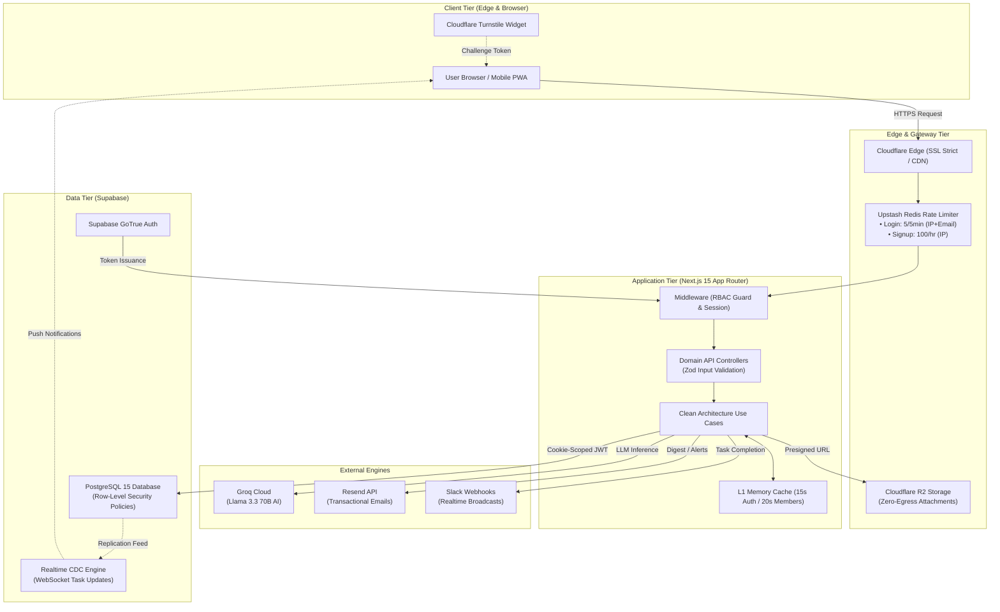

<div align="center">

<br/>

```text
████████╗ █████╗ ███████╗ ██████╗        ██████╗ ███╗   ██╗███████╗
╚══██╔══╝██╔══██╗██╔════╝██╔═══██╗      ██╔═══██╗████╗  ██║██╔════╝
   ██║   ███████║███████╗██║   ██║█████╗██║   ██║██╔██╗ ██║█████╗
   ██║   ██╔══██║╚════██║██║▄▄ ██║╚════╝██║   ██║██║╚██╗██║██╔══╝
   ██║   ██║  ██║███████║╚██████╔╝      ╚██████╔╝██║ ╚████║███████╗
   ╚═╝   ╚═╝  ╚═╝╚══════╝ ╚══▀▀═╝        ╚═════╝ ╚═╝  ╚═══╝╚══════╝
```

### The Intelligent Task Operating System for High-Velocity Teams

_Stop managing mission-critical tasks in WhatsApp chats and messy spreadsheets._  
_Assign with absolute clarity, track live execution in real time, and eliminate repetitive follow-up meetings._

<br/>

[](https://tasq-one.onrender.com)
[](https://nextjs.org/)
[](https://www.typescriptlang.org/)
[](https://supabase.com/)
[](https://cloudflare.com/)
[](https://groq.com/)
[](https://upstash.com/)
[](./LICENSE)

<br/>

[](https://tasq-one.onrender.com)
[](https://tasq-one.onrender.com/features)
[](https://tasq-one.onrender.com/pricing)
[](https://tasq-one.onrender.com/security)

<br/>

|              ⚡ **1–3s Page Loads**              |          🛡️ **Zero-IDOR RLS**          |  🤖 **Sub-Second Groq AI**  | 🔒 **Turnstile Bot Shield** |    🇮🇳 **100% INR / DPDP Ready**     |
| :----------------------------------------------: | :------------------------------------: | :-------------------------: | :-------------------------: | :---------------------------------: |
| Parallel `Promise.all` + Multi-Layer L1/L2 Cache | Tenant-isolated at the DB kernel level | Llama 3.3 70B decomposition | Non-intrusive smart CAPTCHA | Calibrated for Indian tech founders |

<br/>

```
┌────────────────────────────────────────────────────────────────────────────────────────┐
│  Quick Navigation:                                                                     │
│  [Overview](#-overview)  •  [v2.6 Highlights](#-whats-new-in-v26)  •  [Architecture](#-architecture--data-flow)  │
│  [Features](#-core-capabilities)  •  [RBAC Portals](#-role-based-access-portals)  •  [Cloudflare & Supabase](#-cloudflare--supabase-reconfiguration-guide) │
│  [Quick Start](#-quick-start)  •  [Security](#-enterprise-security--compliance)  •  [Verification](#-production-readiness-evidence)  │
└────────────────────────────────────────────────────────────────────────────────────────┘
```

</div>

---

## 🎯 Overview

**TASQ-ONE** is an enterprise-grade, multi-tenant Task Operating System designed from first principles for startups, agile product teams, and engineering organizations who demand **radical operational clarity without software bloat**.

Traditional project management tools are bogged down by sluggish waterfall queries, steep learning curves, and clunky interfaces that inevitably drive teams back into unorganized WhatsApp chats and spreadsheets. **TASQ-ONE fixes this permanently:**

- 🤖 **Sub-Second AI Task Decomposition:** Transform a raw 5-word sentence into production-ready specifications, DoD, and 4-point Acceptance Criteria via Groq Llama 3.3 70B in under 800ms.
- 📋 **Personal Employee Morning Focus:** Distraction-free daily checklists showing only what is due _today_, complete with one-click status transitions.
- 🔗 **Strict DAG Dependency Enforcement:** Visual and logical task blocking preventing downstream execution until prerequisites are verified complete.
- 🛡️ **Zero-IDOR PostgreSQL Row-Level Security:** Cryptographically verified tenant isolation enforced directly in PostgreSQL kernel policies.
- 🔒 **Cloudflare Turnstile Anti-Abuse:** Transparent bot protection on signups paired with a generous 100/hr IP ceiling for frictionless team onboarding.
- 📢 **Async Multi-Channel Broadcasts:** Real-time automated Slack cards and weekly Resend executive digests eliminating synchronous status meetings.

> **Bottom Line:** Founders, engineering leads, and operations managers reclaim **10+ hours every single week**.

---

## 🆕 What's New in v2.6

```
┌──────────────────────────────────────────────────────────────────────────────────────────┐
│                             🚀  VERSION 2.6 PRODUCTION RELEASE                           │
├────────────────────────────────────────┬─────────────────────────────────────────────────┤
│  🛡️ Cloudflare Turnstile Bot Defense   │  Smart anti-bot CAPTCHA on company signup        │
│  ⚡ Re-engineered Rate Limiting        │  Generous 100/hr signup IP ceiling + strict login│
│  🧹 Zero Fake/Mock Data Fallbacks      │  Purged all silent demo arrays from 9 repos     │
│  📊 Real Velocity Telemetry            │  Computed from actual task completion durations │
│  🚨 Next.js 15 Root Error Boundaries   │  Added instrumentation.ts & global-error.tsx    │
│  🧪 10 New Rate Limiting Tests         │  Vitest suite at 60 passed tests, 0 failures    │
└────────────────────────────────────────┴─────────────────────────────────────────────────┘
```

### 1. Cloudflare Turnstile Anti-Abuse + Generous Signup Ceiling

- **The Challenge:** The previous strict 5-attempt rate limit blocked legitimate founders and QA testers from repeatedly creating workspaces during demos and onboarding sessions.
- **The v2.6 Solution:**
  - Integrated **Cloudflare Turnstile** (`lib/security/turnstile.ts` + `components/auth/Turnstile.tsx`) to stop automated bot spam cryptographically without punishing human users.
  - Raised the IP-based registration ceiling to **100 signups per hour per IP** (`ratelimit:signup:${ip}`).
  - Kept login strictly protected at **5 attempts per 5 minutes per IP+email** (`auth:login:${ip}:${email}`) to prevent brute-force attacks.

### 2. Complete Elimination of Demo & Mock Fallbacks

- Removed all hardcoded fallback objects (`mgr-task-1`, `task-emp-1..5`, `{completed: 2}`, `mem-1..3`) across all 9 domain repositories (`dashboardRepository.ts`, `taskRepository.ts`, `userRepository.ts`, etc.).
- Gated all seed generators behind `NODE_ENV !== 'production'`.
- Enforced genuine Cloudflare R2 credentials; missing credentials fail loudly with actionable setup instructions rather than generating fake URLs.
- Replaced hardcoded velocity metrics (`2.8` / `2.4` days) with real completion duration averages.

---

## 🏛️ Architecture & Data Flow



---

## 🚀 Core Capabilities

### `01` 🤖 AI Task Decomposer _(Groq Llama 3.3 70B)_

Input a raw prompt (e.g., _"Integrate Razorpay auto-pay subscriptions"_), and receive a fully formed, production-grade technical ticket in under 800ms:

- Refined technical title and detailed scope summary
- 4-point concrete **Acceptance Criteria**
- Definition of Done (DoD) checklist
- Suggested assignee based on current open backlog count
- Priority score and estimated completion hours

### `02` 🎯 Personal Focus Dashboard _(Employee Portal)_

A distraction-free view designed for morning execution:

- **Profile Hero Card:** Time-of-day greeting, auto-generated Member ID (`EMP-XXXX`) with 1-click clipboard copy, and team badge.
- **Metric Tiles:** Clickable filter cards for _Due Today_, _In Progress_, _Upcoming (7D)_, and _Completed_.
- **Interactive Task Cards:** Priority indicators, overdue badges, subtask progress, and inline status dropdowns.
- **Live Search & Filter:** Instant local filtering by title, tags, and description.

### `03` 📊 Cryptographic Activity & Audit Trail

- **Tamper-Proof Audit Logging:** Every task creation, status transition, assignment, and comment is logged with actor UUID, timestamp, and property diffs.
- **Zero Raw JSON:** Structured cards display visual `property → before / after` badges.
- **CSV Export:** One-click download of audit logs filtered by entity and action.

### `04` 🔗 Strict DAG Task Dependency Engine

- Prevents premature execution of downstream tasks.
- If **Task B** depends on **Task A**, Task B is visually locked and blocked from being marked `in_progress` or `completed` until Task A is verified `completed`.

### `05` 🔄 Unified 10-Second Auto-Refresh

Every role portal features a unified auto-refresh mechanism:

- Real-time countdown timer badge with pulse animation
- 1-click toggle to pause/resume auto-syncing
- Instant manual refresh trigger without full-page reloads

---

## 🧑‍💼 Role-Based Access Portals

| Capability                        | 👑 Founder / Admin | ⚡ Engineering Manager |     👤 Team Member     |
| :-------------------------------- | :----------------: | :--------------------: | :--------------------: |
| **Workspace Setup & Billing**     |   ✅ Full Access   |     ❌ Restricted      |     ❌ Restricted      |
| **Invite & Deactivate Members**   |    ✅ All Roles    |   ✅ Employees Only    |     ❌ Restricted      |
| **Create & Assign Tasks**         |    ✅ Any Team     |    ✅ Managed Teams    |     ❌ Restricted      |
| **View Full Organization Kanban** |  ✅ Full Org View  |     ✅ Team Scoped     | ❌ Personal Tasks Only |
| **Task Status Transitions**       |     ✅ Allowed     |       ✅ Allowed       |   ✅ Assigned Tasks    |
| **Team Re-assignment Dropdown**   |  ✅ In Table Row   |     ❌ Restricted      |     ❌ Restricted      |
| **Audit Log & CSV Export**        |   ✅ Full Access   |     ❌ Restricted      |     ❌ Restricted      |
| **Personal Daily Checklist**      |    ✅ Included     |      ✅ Included       |    ✅ Primary Focus    |

---

## ☁️ Cloudflare & Supabase Reconfiguration Guide

When deploying TASQ-ONE to production (Render, Vercel, or VPS), follow these exact reconfiguration steps:

### 1. Cloudflare Dashboard Setup

1. **Cloudflare Turnstile (Anti-Bot CAPTCHA):**
   - Go to **Turnstile** → **Add Widget**.
   - Set **Domain** to your production URL (e.g., `tasq-one.onrender.com` or custom domain) and include `localhost` for local dev.
   - Choose **Managed** mode.
   - Copy the keys into your hosting environment:
     ```env
     NEXT_PUBLIC_TURNSTILE_SITE_KEY=0x4AAAAAA...
     TURNSTILE_SECRET_KEY=0x4AAAAAA...
     ```
2. **Cloudflare R2 (Task Attachments Storage):**
   - Go to **R2** → **Create Bucket** named `tasq-one-attachments`.
   - Under Bucket Settings, configure **CORS**:
     ```json
     [
       {
         "AllowedOrigins": [
           "https://tasq-one.onrender.com",
           "http://localhost:3000"
         ],
         "AllowedMethods": ["GET", "PUT", "POST", "DELETE", "HEAD"],
         "AllowedHeaders": ["*"],
         "MaxAgeSeconds": 3600
       }
     ]
     ```
   - Generate an API Token with **Object Read & Write** permissions.
3. **Cloudflare SSL/TLS:**
   - Set Encryption Mode to **Full (Strict)**. Enable **Always Use HTTPS**.

### 2. Supabase Dashboard Setup

1. **Database Schema:**
   - Open **SQL Editor** in your Supabase project.
   - Run the consolidated [`supabase/database.sql`](./supabase/database.sql) script to create all tables, indexes, triggers, and RLS policies.
2. **Authentication URLs:**
   - Go to **Authentication** → **URL Configuration**.
   - Set **Site URL** to `https://tasq-one.onrender.com`.
   - Add the following to **Redirect URLs (Allow list)**:
     ```
     https://tasq-one.onrender.com/auth/callback
     https://tasq-one.onrender.com/accept-invite
     https://tasq-one.onrender.com/**
     http://localhost:3000/auth/callback
     http://localhost:3000/accept-invite
     ```
3. **Realtime Replication:**
   - Go to **Database** → **Replication**.
   - Enable replication for tables: `tasks`, `task_comments`, `notifications`, `activity_logs`.
4. **API Keys:**
   - Copy **Project URL**, `anon` `public` key, and `service_role` `secret` key into your environment variables.

---

## 🛠️ Environment Variables Reference

| Variable                         | Required | Description                                               | Example / Fallback                               |
| :------------------------------- | :------: | :-------------------------------------------------------- | :----------------------------------------------- |
| `NEXT_PUBLIC_APP_URL`            | **Yes**  | Fully qualified public application URL                    | `https://tasq-one.onrender.com`                  |
| `NEXT_PUBLIC_SUPABASE_URL`       | **Yes**  | Supabase Project REST / Auth API URL                      | `https://xyzcompany.supabase.co`                 |
| `NEXT_PUBLIC_SUPABASE_ANON_KEY`  | **Yes**  | Supabase Anonymous Client Public Key                      | `eyJhbGciOi...`                                  |
| `SUPABASE_SERVICE_ROLE_KEY`      | **Yes**  | Supabase Admin Secret Key (Server-Only)                   | `eyJhbGciOi...`                                  |
| `NEXT_PUBLIC_TURNSTILE_SITE_KEY` | **Yes**  | Cloudflare Turnstile Public Site Key                      | `0x4AAAAAA...`                                   |
| `TURNSTILE_SECRET_KEY`           | **Yes**  | Cloudflare Turnstile Secret Key                           | `0x4AAAAAA...`                                   |
| `GROQ_API_KEY`                   | **Yes**  | Groq Cloud API Key for Llama 3.3 70B                      | `gsk_...`                                        |
| `UPSTASH_REDIS_REST_URL`         | Optional | Upstash Redis REST endpoint for distributed rate limiting | `https://...upstash.io` _(falls back to memory)_ |
| `UPSTASH_REDIS_REST_TOKEN`       | Optional | Upstash Redis authentication token                        | `...`                                            |
| `RESEND_API_KEY`                 | Optional | Resend API key for email invitations & weekly summaries   | `re_...`                                         |
| `EMAIL_FROM`                     | Optional | Sender address for transactional emails                   | `TASQ-ONE <notifications@yourdomain.com>`        |
| `NEXT_PUBLIC_POSTHOG_KEY`        | Optional | PostHog Project API key for client-side telemetry         | `phc_...`                                        |
| `SENTRY_DSN`                     | Optional | Sentry DSN for server/client error capture                | `https://...@sentry.io/...`                      |
| `CRON_SECRET`                    | Optional | Bearer secret for automated weekly summary cron jobs      | `32-character-random-secret`                     |

---

## 🚀 Quick Start

### 1 · Clone Repository

```bash
git clone https://github.com/Tusharsinghoffical/TASQ-ONE.git
cd TASQ-ONE
```

### 2 · Install Dependencies

```bash
npm install
```

### 3 · Configure Environment

```bash
cp .env.local.example .env.local
# Populate your Supabase, Turnstile, and Groq credentials in .env.local
```

### 4 · Run Development Server

```bash
npm run dev
```

Open [http://localhost:3000](http://localhost:3000) in your browser.

### 5 · Execute Test Suite

```bash
npm test              # Run all 6 test suites via Vitest
npx tsc --noEmit      # Validate complete TypeScript typing
npm run lint          # Run ESLint across all files
npm run build         # Verify production build compilation
```

---

## 🔒 Enterprise Security & Compliance

```
[Client Request]
       │
       ▼
[Cloudflare Turnstile] ──► (Validates Human vs. Automated Bot)
       │
       ▼
[Upstash Redis Limiter] ──► (Login: 5/5min | Signup: 100/hr)
       │
       ▼
[Next.js RBAC Guard] ──► (Validates JWT Claims & 15s Session Cache)
       │
       ▼
[PostgreSQL Kernel RLS] ──► (auth.jwt() ->> 'org_id'::uuid strict isolation)
```

- **Fail-Closed Privilege Defense:** `verifyRole` strictly rejects missing or unauthenticated roles with HTTP 403. Self-escalation via user metadata updates is blocked.
- **Composite Brute-Force Shield:** Login rate limiting is composite-keyed on `auth:login:${ip}:${email}`, preventing credential stuffing even across rotating IP addresses.
- **DPDP Act 2023 & GDPR Compliant:** Customer workspace data is never used to train public models. Audit trails provide verifiable accountability.

---

## 🧪 Production Readiness Evidence

As verified in [docs/REAL-PRODUCTION-READINESS-REPORT.md](./docs/REAL-PRODUCTION-READINESS-REPORT.md):

```text
✓ tests/integration/auth_rate_limiting.test.ts (10 tests)
✓ tests/rls/cross_role_routing.test.ts (20 tests)
✓ tests/domains/task_business_rules.test.ts (4 tests)
✓ tests/integration/services.test.ts (9 tests)
✓ tests/domains/hierarchy_visibility.test.ts (7 tests)
✓ tests/rls/multi_tenant_isolation.test.ts (12 tests | 2 skipped without Docker DB)

Test Files: 6 passed (6)
Tests:      60 passed | 2 skipped (62)
TypeScript: 0 errors (npx tsc --noEmit)
ESLint:     0 warnings, 0 errors (npm run lint)
Build:      39 static pages, 49 total routes compiled successfully (npm run build)
```

---

## 📬 Contact & Commercial Support

<div align="center">

| Channel                           | Details                                                                |
| :-------------------------------- | :--------------------------------------------------------------------- |
| 📧 **Primary Inquiries**          | [tasqoneworkos@gmail.com](mailto:tasqoneworkos@gmail.com)              |
| 👨‍💻 **Lead Architect & Developer** | [Tushar Singh](https://codewithmrsingh.me/) (`codewithmrsingh.me`)     |
| 🐛 **Bug Tracker**                | [GitHub Issues](https://github.com/Tusharsinghoffical/TASQ-ONE/issues) |
| 🏢 **Headquarters**               | Delhi / Pune · India                                                   |

<br/>

Distributed under the **MIT License**. See [LICENSE](./LICENSE) for complete details.

```
┌──────────────────────────────────────────────────────────────────────────┐
│        ⚡ TASQ-ONE v2.6 — Built for Velocity. Built for Security.        │
│          Crafted with ❤️ by Tushar Singh (codewithmrsingh.me)             │
└──────────────────────────────────────────────────────────────────────────┘
```

</div>
