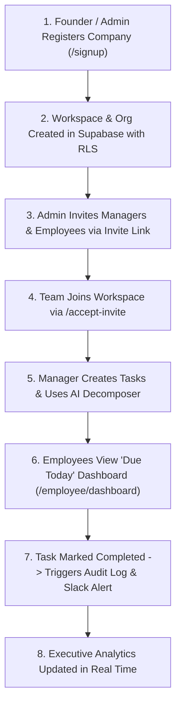
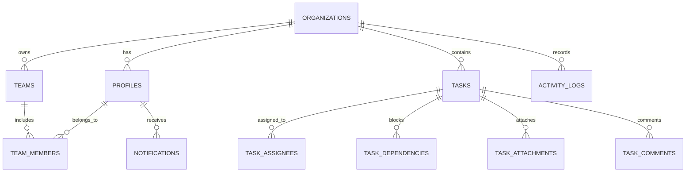

# 📘 TASQ-ONE — Complete Master Project Handbook (A to Z Guide)

> **Product Name:** TASQ-ONE Work OS (Intelligent Task Operating System)  
> **Creator & Lead Architect:** [Tushar Singh](https://codewithmrsingh.me/) (`https://codewithmrsingh.me/`)  
> **Live Production Platform:** [https://tasq-one.onrender.com](https://tasq-one.onrender.com)  
> **Repository:** [https://github.com/Tusharsinghoffical/Saas-T1](https://github.com/Tusharsinghoffical/Saas-T1)  
> **Official Support:** [tasqoneworkos@gmail.com](mailto:tasqoneworkos@gmail.com)  
> **Headquarters:** Delhi / Pune, India  
> **Release Version:** v1.0.0-MVP (Enterprise Multi-Tenant Edition)

---

## 📑 Table of Contents
1. [Executive Summary (Yeh Project Kya Hai?)](#1-executive-summary-yeh-project-kya-hai)
2. [The Core Problem (Yeh Kyu Banaya Gaya?)](#2-the-core-problem-yeh-kyu-banaya-gaya)
3. [The Solution & Unique Value Proposition](#3-the-solution--unique-value-proposition)
4. [Target Audience & Who Benefits (Kisko Kya Fayda?)](#4-target-audience--who-benefits-kisko-kya-fayda)
5. [Core Features & Modules Breakdown](#5-core-features--modules-breakdown)
6. [Step-by-Step User Workflows (Kaise Kaam Karta Hai?)](#6-step-by-step-user-workflows-kaise-kaam-karta-hai)
7. [Role-Based Access Control (RBAC 3-Way Strict Confinement)](#7-role-based-access-control-rbac-3-way-strict-confinement)
8. [Complete Technology Stack](#8-complete-technology-stack)
9. [Database Schema & Multi-Tenant Architecture](#9-database-schema--multi-tenant-architecture)
10. [Security & Compliance Architecture](#10-security--compliance-architecture)
11. [Pricing Model & Business ROI Calculator](#11-pricing-model--business-roi-calculator)
12. [Live Production Endpoints & Pages Directory](#12-live-production-endpoints--pages-directory)
13. [Future Phase 2 Roadmap](#13-future-phase-2-roadmap)

---

## 1. 💡 Executive Summary (Yeh Project Kya Hai?)

**TASQ-ONE** ek modern, enterprise-grade **Intelligent Task Operating System (Work OS)** hai. 

Yeh software fast-growing startups, software engineering teams, marketing agencies aur SMBs (Small-Medium Businesses) ke liye banaya gaya hai taaki wo apne team deliverables, client projects aur daily tasks ko bina kisi confusion ke track kar sakein.

### Ek Line Me Pitch:
> *"Stop Managing Tasks in WhatsApp Group Chats & Messy Spreadsheets. TASQ-ONE converts vague instructions into verified deliverables with instant AI decomposition, automated Slack alerts, and zero status meetings."*

---

## 2. ⚠️ The Core Problem (Yeh Kyu Banaya Gaya?)

India aur worldwide me 90% se zyada growing companies apna daily task coordination **WhatsApp groups** ya **Google Sheets** me karti hain. Isse 4 badi problems paida hoti hain:

1. **Information Black Hole (WhatsApp Chaos):**
   - WhatsApp me 50 messages ke baad task kho jaata hai. Kisne kya kaam karna tha, kab tak dena tha, koi record nahi rehta.
2. **Endless Follow-up Meetings & Micromanagement:**
   - Managers ko har roz 1 se 2 ghante sirf yeh puchne me lag jaate hain: *"Rohan, us client ki file ka kya hua?"*, *"Priya, design ready hai kya?"*.
3. **Vague Instructions & Rework:**
   - Founder ya Manager bolte hain: *"Diwali campaign bana do"*. Employee ko samajh nahi aata ki actual deliverables, acceptance criteria aur deadline kya hai. Result = galat kaam aur project delay.
4. **Heavy Enterprise Software Bloat (Jira/Asana Complexity):**
   - Jira ya Asana jaise tools itne complex aur expensive hote hain ki non-technical staff unhe use hi nahi kar paate aur wapas WhatsApp par shift ho jaate hain.

---

## 3. 🚀 The Solution & Unique Value Proposition

TASQ-ONE in sabhi problems ko single-click smart workflows se solve karta hai:

- 🧠 **Instant AI Deliverable Decomposer (Groq Llama 3.3 70B):** Ek simple sentence type karo (e.g. *"Launch UPI AutoPay Checkout"*), aur AI sub-second me 4-point technical acceptance criteria, time estimates aur assignees generate kar deta hai.
- 📋 **Distraction-Free "Due Today" Focus Mode:** Employees ke samne 500 tasks ka pahad nahi hota. Subah aate hi unhe sirf unke **aaj ke tasks** dikhte hain with single-click status toggles.
- 🔒 **Task Dependency DAG (Directed Acyclic Graph):** Task tab tak "Completed" nahi ho sakta jab tak uske dependent blocker tasks approve aur merge na ho jaayein.
- 📢 **Automated Async Slack & Email Broadcasts:** Jab bhi koi task complete hota hai, team ke Slack channel par automatically rich notification card chala jaata hai. Managers ko 1 bhi call ya meeting karne ki zaroorat nahi padti.
- 🇮🇳 **Indian Localization & ₹0 Free Pilot Model:** ₹ INR currency, Mumbai cloud data residency, DPDP Act 2023 compliance, aur 5-member team ke liye 100% Free Starter Pilot.

---

## 4. 👥 Target Audience & Who Benefits (Kisko Kya Fayda?)

| Target Role | Problem Faced | TASQ-ONE Solution & Benefit |
| :--- | :--- | :--- |
| **Founders & CEOs** | Din bhar status updates chase karte hain aur vision par focus nahi kar paate. | 5 second me organization-wide high-level dashboard dekh kar 10+ hours/week bacha sakte hain. |
| **Project & Engineering Managers** | Sprints delay hote hain, blockers late pata chalte hain. | Visual Kanban board, AI Acceptance criteria, aur automated DAG blocker warnings. |
| **Software & Design Engineers** | Vague requirements aur bar-bar distraction meetings. | Clear checklist, acceptance criteria, aur distraction-free morning dashboard. |
| **Marketing & Client Agencies** | Multiple client deadlines mix ho jaate hain, assets miss hote hain. | Multi-client sprint separation, Cloudflare R2 file attachments, instant deliverable cards. |
| **Operations & SMB Branches** | Daily branch compliance aur vendor bills follow-up miss hote hain. | Daily recurring checklists, audit logs, and branch-level task segregation. |

---

## 5. 🧩 Core Features & Modules Breakdown

### 1. 🗂️ Live Sprint Delivery Kanban Board
- Drag-and-Drop column transitions: **To Do**, **In Progress**, **Review**, **Completed**.
- Color-coded urgency badges (`Urgent`, `High`, `Medium`, `Low`).
- Real-time assignee avatars, due date countdowns, and quick search filters.

### 2. ⚡ Instant AI Task Decomposer (Powered by Groq Cloud)
- **Model:** Llama 3.3 70B Versatile.
- **Inference Speed:** < 1 second.
- Vague ideas ko 4-part structured tickets me convert karta hai:
  1. Clear Technical Title
  2. Priority & Department Mapping
  3. 4-Bullet Point Definition of Done (Acceptance Criteria)
  4. Realistic Time & Capacity Estimation

### 3. 🎯 "Due Today" Employee Morning Focus Mode
- Employees ke liye simplified view.
- Subah aate hi direct checklist dikhti hai jo aaj deliver karni hai.
- Single-click progress updates jisse context switching zero ho jaata hai.

### 4. 🔗 Hard Dependency DAG (Blocking Logic)
- Parent-Child task mapping.
- Agar Task B, Task A par dependent hai, toh system Task B ko complete mark karne se hard-block kar deta hai jab tak Task A verified na ho.

### 5. 📁 Secure Asset Management (Cloudflare R2)
- Zero-egress fee high-speed object storage.
- Screenshots, PRDs, client invoices, aur design assets secure tenant-isolated folders me upload hote hain (`${orgId}/${taskId}/...`).

### 6. 📢 Automated Async Alerts (Slack & Resend Email)
- Completed deliverables automatically Slack channels me format hokar broadcast hoti hain.
- Managers aur client leads ko real-time progress update milta hai.

### 7. 📱 Progressive Web App (PWA) & Offline Viewing
- Desktop (Chrome, Edge, Brave) aur Mobile (Android, iOS) par installable software ki tarah chalta hai.

---

## 6. 🔄 Step-by-Step User Workflows (Kaise Kaam Karta Hai?)



### Flow A: Company Registration & Onboarding
1. Founder `https://tasq-one.onrender.com/signup` par jaata hai.
2. Company Name, Admin Full Name, Email, Password enter karta hai.
3. System database me:
   - `organizations` table me naya tenant create karta hai.
   - `profiles` table me admin profile set karta hai with `role: 'admin'`.
   - Admin automatically `/admin/dashboard` par redirect hota hai.

### Flow B: Team Member Invitation
1. Admin/Manager dashboard se employee email aur role (`manager` ya `employee`) select karke invite bhejta hai.
2. Supabase Auth Admin API ek secure expiring token generate karti hai.
3. Employee invite link open karta hai (`/accept-invite?token=...`), apna password set karta hai aur direct apne respective dashboard par land karta hai.

### Flow C: Task Execution & Delivery
1. Manager task create karta hai aur "Enhance with AI" click karta hai.
2. Groq AI sub-second me complete ticket generate karta hai.
3. Assignee employee ko task allocate hota hai.
4. Employee task deliver karta hai aur checklist tick karta hai.
5. System database me immutable audit log record karta hai aur Slack channel me alert post karta hai.

---

## 7. 🔐 Role-Based Access Control (RBAC 3-Way Strict Confinement)

TASQ-ONE enterprise security standard follow karta hai jisme har role strictly isolated hai:

```
                  ┌─────────────────────────────────┐
                  │  Unified Login (/login)         │
                  └────────────────┬────────────────┘
                                   │
              ┌────────────────────┼────────────────────┐
              │                    │                    │
              ▼                    ▼                    ▼
     ┌─────────────────┐  ┌─────────────────┐  ┌─────────────────┐
     │  ADMIN ROLE     │  │  MANAGER ROLE   │  │  EMPLOYEE ROLE  │
     │  (/admin/*)     │  │  (/manager/*)   │  │  (/employee/*)  │
     └────────┬────────┘  └────────┬────────┘  └────────┬────────┘
              │                    │                    │
       Company Analytics      Sprint Planning     Due Today Focus
       Team & Invites         Task Allocation     Deliverable Checklist
       Audit Logs & Config    Slack Webhooks      Task Comments & Media
```

- **Strict Route Enforcement:** Middleware agar detect kare ki Employee `/admin/dashboard` access karne ki koshish kar raha hai, toh turant **HTTP 307** se `/employee/dashboard` par redirect kar deta hai.
- **Privilege Escalation Protection:** SQL migration `0008` ensure karta hai ki koi bhi non-admin user API call bhej kar apna `role` ya `org_id` modify nahi kar sakta.

---

## 8. 💻 Complete Technology Stack

| Layer | Technology | Version | Purpose in TASQ-ONE |
| :--- | :--- | :---: | :--- |
| **Frontend UI** | **Next.js (App Router)** | `14.2.35` | SSR, React Server Components, Fast Navigation |
| **Language** | **TypeScript** | `5.x` | Strict type safety, domain-driven contracts |
| **Styling** | **Tailwind CSS** | `3.4.1` | Custom SaaS design tokens, Glassmorphism, Responsive |
| **Icons & UI** | **Lucide React** | `^0.359.0` | Modern vector UI icons |
| **Database** | **Supabase (PostgreSQL)** | `15.x` | Relational ACID engine, Row-Level Security (RLS) |
| **Auth & JWT** | **Supabase Auth + Custom Hook** | `v2` | Session management with custom JWT claims (`org_id`, `role`) |
| **AI Inference** | **Groq Cloud (Llama 3.3 70B)** | Latest | Ultra-fast sub-second task decomposition |
| **Caching & Limits** | **Upstash Redis** | Serverless | Distributed token-bucket rate limiting on Auth routes |
| **File Storage** | **Cloudflare R2** | S3 API | Zero-egress fee encrypted attachment storage |
| **Async Alerts** | **Slack Incoming Webhooks** | REST | Real-time automated deliverable notification cards |
| **Email Gateway** | **Resend** | REST | Transactional invite emails and weekly executive digests |
| **Containerization** | **Docker** | Multi-Stage | Production `node:22-alpine` optimized container |
| **Cloud Hosting** | **Render Web Service** | Free/Pro | Live Docker deployment with automated CI/CD |
| **Testing** | **Vitest** | `4.1.11` | Automated test runner (30/30 passing security & unit tests) |

---

## 9. 🗄️ Database Schema & Multi-Tenant Architecture

Supabase PostgreSQL me 11 dedicated tables hain jo Row-Level Security (RLS) se 100% tenant-isolated hain:



1. **`organizations`**: Workspace metadata, custom domain, subscription status.
2. **`profiles`**: User details, `role` (`admin` | `manager` | `employee`), `org_id`, active status.
3. **`teams`**: Departmental squads (Engineering, Marketing, Sales, Operations).
4. **`team_members`**: User-to-Team mapping.
5. **`tasks`**: Title, description, status (`todo`, `in_progress`, `review`, `completed`), priority, due dates.
6. **`task_assignees`**: Multiple user assignments per deliverable.
7. **`task_dependencies`**: Hard DAG prerequisite blockers.
8. **`task_attachments`**: Cloudflare R2 object keys and file metadata.
9. **`task_comments`**: Discussion threads on specific deliverables.
10. **`activity_logs`**: Immutable audit logs of every status transition and update with actor ID.
11. **`notifications`**: User in-app notifications.

---

## 10. 🛡️ Security & Compliance Architecture

TASQ-ONE ko bank-grade security standards par architect kiya gaya hai:

- 🔒 **PostgreSQL Row-Level Security (RLS):** Har SQL query me `auth.jwt() ->> 'org_id'` verify hota hai. Agar koi user doosri company ka ID daal kar query kare, PostgreSQL 0 rows return karta hai.
- 🛡️ **SSRF Attack Protection:** Slack webhook validation me strict `https://hooks.slack.com/services/` domain allowlist enforced hai.
- ⏱️ **Distributed Rate Limiting:** Login, Signup aur Invite endpoints par 5 requests / 5 minute ka sliding-window rate limit active hai via Upstash Redis.
- 🔑 **Password Policy:** Minimum 8 characters with at least 1 uppercase letter aur 1 numeric digit mandatory.
- 🇮🇳 **DPDP Act 2023 (India) Compliance:** Purpose limitation, customer data ownership, zero public AI model training, aur instant data export/purge rights.

---

## 11. 💰 Pricing Model & Business ROI Calculator

### Active Pricing Model (Launch Phase):
- **₹0 Free Starter Pilot:**
  - Up to 5 Team Members
  - Unlimited Tasks & Kanban Boards
  - Core Groq AI Task Decomposer
  - Full PostgreSQL RLS Data Security
  - Zero lock-in, no credit card or UPI mandate required.

### Business ROI Calculation Formula:
> **Weekly Hours Saved:** $\text{Team Size} \times \text{Hours Wasted on Follow-ups} \times 0.70$  
> **Monthly Value Reclaimed (₹ INR):** $\text{Total Hours Saved} \times ₹1,200/\text{hr (Indian tech baseline)}$

*Example for an 8-person team:*
- 8 members wasting 4 hrs/week = 32 hours lost weekly.
- TASQ-ONE reclaims **134+ hours every month**.
- Monthly business capacity reclaimed = **₹1,61,280 / month**.

---

## 12. 🌐 Live Production Endpoints & Pages Directory

| Route / URL | Component / Page | Description |
| :--- | :--- | :--- |
| **`/`** | `app/page.tsx` | Main Landing Page with Interactive Live Kanban & AI Simulator |
| **`/solutions`** | `app/solutions/page.tsx` | Dedicated Tailored Solutions for Founders, Tech & Operations |
| **`/pricing`** | `app/pricing/page.tsx` | Plans Breakdown, ₹0 Pilot Details & Pricing FAQ |
| **`/features`** | `app/features/page.tsx` | Interactive Feature Showcase & Live Sandboxes |
| **`/signup`** | `app/signup/page.tsx` | "Register Your Company" (Founding Admin Workspace Creation) |
| **`/login`** | `app/login/page.tsx` | Smart Unified Sign-In with Database Role Detection |
| **`/accept-invite`**| `app/accept-invite/page.tsx`| Single-use secure token invite acceptance for staff |
| **`/admin/*`** | `app/admin/dashboard/` | Organization Analytics, Staff Management & Workspace Settings |
| **`/manager/*`** | `app/manager/dashboard/` | Sprint Deliverable Boards, Task Assignment & Invites |
| **`/employee/*`**| `app/employee/dashboard/`| "Due Today" Focus View & Personal Checklist |
| **`/api/v1/health`**| `app/api/v1/health/route.ts`| Live JSON Health Check (`{"status":"ok"}`) |

---

## 13. 🗺️ Future Phase 2 Roadmap

1. **Paid Subscription Tiers (SMB Pro ₹999 & Enterprise ₹2,499):**
   - Razorpay UPI AutoPay + NetBanking for India.
   - Stripe for international credit cards.
2. **Native WhatsApp Business API Alerts:**
   - Direct deliverable status alerts on WhatsApp via Gupshup/MSG91.
3. **Custom Domain Multi-Tenancy:**
   - Companies can map their own domain (e.g. `tasks.company.com`) via Cloudflare SSL proxy.
4. **Git Commit & PR Webhook Linker:**
   - Auto-close TASQ-ONE tickets when GitHub/GitLab pull requests are merged.

---

<div align="center">
<h3>TASQ-ONE Platform Inc.</h3>
<b>Crafted with ❤️ by <a href="https://codewithmrsingh.me/">Tushar Singh</a></b><br/>
Portfolio: <a href="https://codewithmrsingh.me/">https://codewithmrsingh.me/</a> • Email: <a href="mailto:tasqoneworkos@gmail.com">tasqoneworkos@gmail.com</a><br/>
📍 Delhi / Pune HQ • India
</div>
